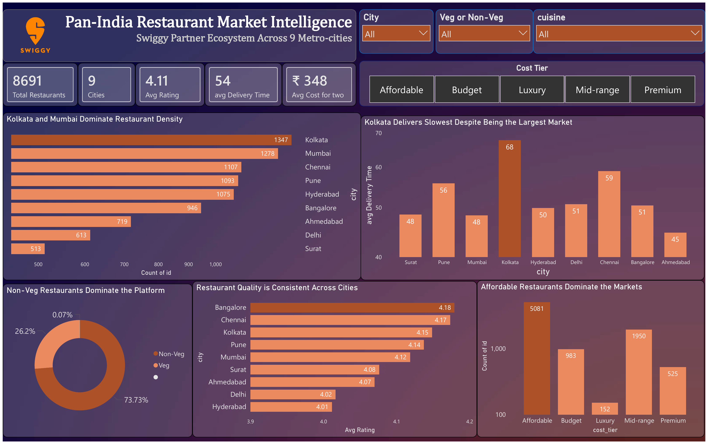
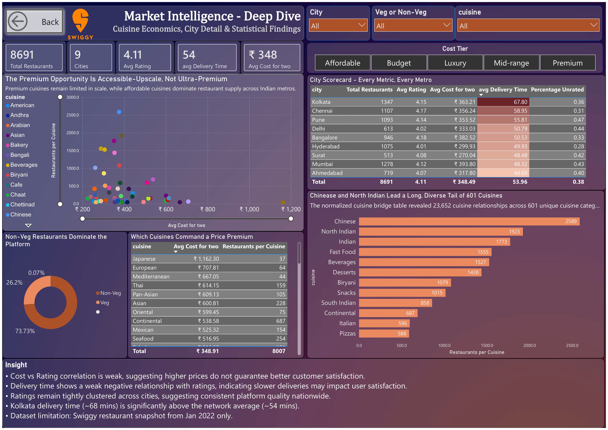

# 🍴 Pan-India Restaurant Market Intelligence — Swiggy (9 Metros)

> Analyzing **8,691 restaurants** across **9 Indian metros** to answer one question: *where should Swiggy prioritize growth next?*

An end-to-end data analytics case study — from a messy, scraped CSV to a stakeholder dashboard and a written recommendation. Built with **PostgreSQL → Python → Power BI**.

📖 **[Read the full analytical write-up →](https://saimmi.github.io/swiggy-market-intelligence/)**

---

## 📌 The brief

The project is framed as a data analyst on Swiggy's national strategy team. Leadership wants a decision, not a chart dump: **which markets are mature, which are thin, where is quality strongest, and where does the pricing opportunity sit?** Everything in the pipeline points back at that question.

> **Scope note:** Dataset sourced from **Kaggle** (Swiggy restaurants data), a snapshot from **January 2022**. It covers only restaurants where Swiggy operates as a delivery partner — so findings describe Swiggy's competitive footprint per city, not the total restaurant universe. The "strategy team" framing is a portfolio device, not a real engagement.

---

## 🛠 The pipeline

| Stage | Tool | What happens |
|---|---|---|
| **1. Stage** | PostgreSQL | Load the messy CSV as-is into a text-only staging table |
| **2. Clean** | PostgreSQL | Cast types, null the junk (`'--'`, `'₹300'`, `'Too Few Ratings'`), add boolean flags |
| **3. Categorise** | PostgreSQL | Bucket continuous values into business tiers (rating / cost / delivery / review volume) |
| **4. Normalise** | PostgreSQL | Explode the multi-valued `cuisines` field into a 1NF bridge table |
| **5. Analyse** | Python | Distributions, correlations, effect sizes (pandas, scipy) |
| **6. Visualise** | Power BI | Two-page stakeholder dashboard |

```
Raw CSV → PostgreSQL (clean + model) → Python (EDA + stats) → Power BI (dashboard) → recommendation
```

---

## 🔑 Key findings

**1. Supply is lopsided.** Kolkata (1,347) and Mumbai (1,278) anchor the network; Delhi (613) and Surat (513) run thin.

**2. The operations red flag.** Ratings are uniform across cities (4.01–4.18) — **quality doesn't differentiate markets**. Delivery speed does: **Kolkata is the largest market yet the slowest at ~68 min** vs a 45–59 min band everywhere else.

**3. Price doesn't buy a rating.** Cost vs rating correlates at only **r = 0.137**, and delivery time vs rating at **r = –0.045** — statistically significant only because the sample is large, practically near-zero.

**4. The cuisine opportunity is in the middle.** What's common isn't what's expensive. Japanese (₹1,162) is premium but rare; North Indian / Chinese are cheap and everywhere; **Italian & Continental are the profitable "accessible-upscale" middle** — priced above median and widely available.

### City scorecard

| City | Restaurants | Avg rating | Avg ₹ | Delivery (min) | % Unrated |
|---|---:|---:|---:|---:|---:|
| Kolkata | 1,347 | 4.15 | 363 | **67.8** | 36.1 |
| Mumbai | 1,278 | 4.12 | 394 | 48.3 | 42.6 |
| Chennai | 1,107 | 4.17 | 356 | 59.0 | 31.3 |
| Pune | 1,093 | 4.14 | 354 | 55.8 | 47.5 |
| Hyderabad | 1,075 | 4.01 | 300 | 49.9 | 27.9 |
| Bangalore | 946 | 4.18 | 383 | 50.5 | 32.6 |
| Ahmedabad | 719 | 4.07 | 318 | 44.7 | 40.3 |
| Delhi | 613 | 4.02 | 333 | 50.8 | 43.9 |
| Surat | 513 | 4.08 | 270 | 48.5 | 42.3 |

---

## 💡 Recommendations

1. **Fix Kolkata delivery operations first** — largest market by supply, worst delivery experience. Highest-leverage operational move.
2. **Defend the affordable core, test accessible-premium** — hold the mid-budget base; trial Italian/Continental cuisines in saturated metros.
3. **Don't compete on quality** — it's already uniform across cities. Speed and price are the real levers.

---

## 🧰 Technical highlights

- **Loaded a messy scraped CSV with zero data loss** by staging everything as `VARCHAR` first, then cleaning — after Excel choked on 738 parsing errors from embedded commas, quotes, and newlines.
- **Normalised a multi-valued field into a bridge table** (1NF): `23,652` restaurant–cuisine links across `601` distinct cuisines. The first split broke multi-word names ("North Indian" → "North", "Indian"); fixed by splitting on quote-space-quote with `REGEXP_SPLIT_TO_TABLE`.
- **Reported effect sizes alongside p-values** — flagging when a "significant" result (e.g. veg vs non-veg, *d* = 0.20) is too small to act on.
- **Titled every dashboard visual as a takeaway**, not a label, so a stakeholder reads conclusions, not axes.

---

## 📂 Repository contents

| File | What it is |
|---|---|
| [`Swiggy_dataset.csv`](./Swiggy_dataset.csv) | Original raw dataset downloaded from Kaggle — 8,691 rows, all text, pre-cleaning |
| [`swiggy_data_cleaning.sql`](./swiggy_data_cleaning.sql) | Complete PostgreSQL cleaning + normalisation script |
| [`swiggy_eda.ipynb`](./swiggy_eda.ipynb) | Python EDA & statistical analysis notebook |
| [`Dashboard_PowerBi.pbix`](./Dashboard_PowerBi.pbix) | Two-page Power BI dashboard (interactive source file) |
| [`Dashboard_PowerBi.pdf`](./Dashboard_PowerBi.pdf) | Dashboard exported as PDF for quick viewing |
| [`restaurants_clean.csv`](./restaurants_clean.csv) | Cleaned fact table — 8,691 rows × 21 columns |
| [`restaurant_cuisines.csv`](./restaurant_cuisines.csv) | Cuisine bridge table — 23,652 rows |
| [`swiggy-market-intelligence.html`](./swiggy-market-intelligence.html) | The full analytical write-up (open in a browser / GitHub Pages) |

---

## 📊 Dashboard

**Page 1 — Executive View**


**Page 2 — Analyst Deep Dive** (cuisine economics, city scorecard, statistical findings)

---

## 🚀 Tech stack

`PostgreSQL` · `Python (pandas, scipy)` · `Power BI` · `SQL` · `Data Cleaning` · `Statistical Analysis` · `Data Visualization`

---

## 🔭 What I'd improve next

- Investigate the `delivery_time` units — the distribution skews almost entirely Slow/Very Slow, hinting the field may not be plain minutes.
- Handle the `cost_for_two = 0` values surfaced in validation (missing, not free).
- Standardise overlapping cuisine labels (`Indian` vs `North Indian` vs `South Indian`) and add formal PK/FK constraints between the two tables.

---

<sub>Dataset: Swiggy restaurants via Kaggle, Jan 2022 snapshot. All figures computed directly from the cleaned tables.</sub>
---
## Project Links

- 📁 [GitHub Repository](https://github.com/saimmi/swiggy-market-intelligence)
- 📝 [Blog / Case Study](https://saimmi.github.io/swiggy-market-intelligence/)
- 💼 [LinkedIn Profile](https://www.linkedin.com/in/s-nisha-31a78b212/)

